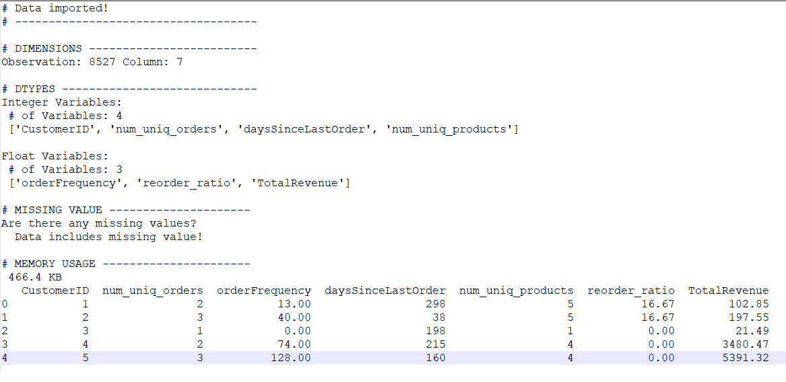
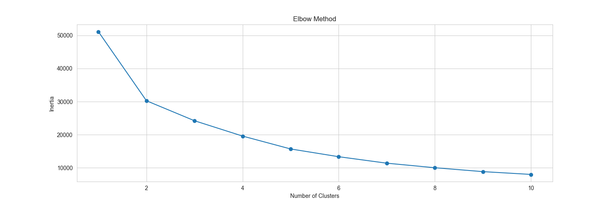
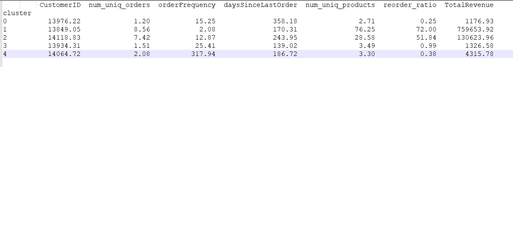

CUSTOMER SEGMENTATION USING PURHASING PATTERNS

The Dataset is extracted from the MSSQL adventureworks database analyzing customer sales orders as of July 2014

----------------------Query used to capture the data--------------------------------

```
DECLARE @end_date AS DATE = '2014-07-31';
WITH OrderREF as
(
select
C.CustomerID,
LAG(SOH.OrderDate) over (partition by C.CustomerID order by SOH.OrderDate) PreVOrderDate,
SOH.OrderDate,
SOD.ProductID,
SOH.SalesOrderID,
SOD.OrderQty \* PRD.ListPrice AS Revenue

    from
    	Sales.Customer C
    Join
    	Sales.SalesOrderHeader SOH
    	on C.CustomerID = SOH.CreditCardID
    Join
    	Sales.SalesOrderDetail SOD
    	on SOH.SalesOrderID = SOD.SalesOrderID
    LEFT JOIN Production.Product PRD
    	on PRD.ProductID = SOD.ProductID

),
CustProd as
(
select
C.CustomerID,
SOH.SalesOrderID,
SOD.ProductID,
CASE
when
count(SOD.ProductID) over (partition by C.CustomerID,SOD.ProductID order by SOH.SalesOrderID ) >
count(SOD.ProductID) THEN 1
ELSE 0
END AS PRIOR_PURCHASE

from
Sales.Customer C
Join
Sales.SalesOrderHeader SOH
on C.CustomerID = SOH.CreditCardID
Join
Sales.SalesOrderDetail SOD
on SOH.SalesOrderID = SOD.SalesOrderID
group by
C.CustomerID,
SOH.SalesOrderID,
SOD.ProductID

),
SegmentCust as
(

     select
    	A.CustomerID,
    	count(distinct A.SalesOrderID) as num_uniq_orders,
    	AVG(DATEDIFF(day, PreVOrderDate, OrderDate)) orderFrequency, --Average days between orders
    	DATEDIFF(day, MAX(OrderDate), @end_date) daysSinceLastOrder,
    	count(distinct A.ProductID) num_uniq_products,
    	round(100 * AVG(CAST(PRIOR_PURCHASE AS float)),2) reorder_ratio, -- Percentage of reordered items
    	round(SUM(A.revenue),2) AS TotalRevenue
    from
    	OrderREF A
    JOIN
    	CustProd B
    	on A.CustomerID = B.CustomerID and A.SalesOrderID = B.SalesOrderID and A.ProductID = B.ProductID
    group by
    	A.CustomerID

)
select \*
from
SegmentCust SC
order by
SC.CustomerID
```

---

Column:

- CustomerID : Customer identifier
- num_uniq_orders : Total Orders
- orderFrequency : Average days between orders
- daysSinceLastOrder : Days since last order (Recency)
- num_uniq_products : Unique number of products purchase
- reorder_ratio : Types of products frequently purchased (ratio)
- TotalRevenue : Total Revenue from customer

  Dataset description
  

Using the elbo methon on Kmean clusters (5) we can less significant decrease in inertia after 5 clusters.



Distribution of clusters after performing kmean prediction
cluster
3 4443
0 2760
4 1065
2 195
1 64
Name: count, dtype: int64

We can see cluster 3 has the most customers, followed by cluster 0 and cluster 1 has the least amount of customers.

Summarize cluster data (mean)


Based on the cluster summary, we can label the segments:

1.) Loyal Customers (Cluster 2):

High total orders, high purchase frequency, low recency and High revenue.

Example: Customers who shop frequently and recently.

2.) At-Risk Customers (Cluster 4):

High recency, low purchase frequency and low total orders.

Example: Customers who haven’t shopped in a while.

3.) Infrequenty Shopper (Cluster 0):

Low total orders, low product diversity, low recency.

Example: Customers who have placed only a few orders infrequently.

4.) Bulk Buyers (Cluster 1):

High total orders, high product diversity, High reorder ratio.

Example: Customers who buy large quantities or a variety of products.

4.) Regular Buyer (Cluster 3):

low total orders, Moderate Purchase frequency, low product diversity

Example: Customers who buy same products repeatedly.

Action to Take (suggestions)

Loyal Customers: Offer loyalty rewards or exclusive discounts.

At-Risk Customers: Send re-engagement emails/texts or special offers.

New Customers: Provide welcome discounts or product recommendations.

Bulk Buyers: Offer bulk discounts or subscription plans.

Regular Customers: Send special offers or discounts.
